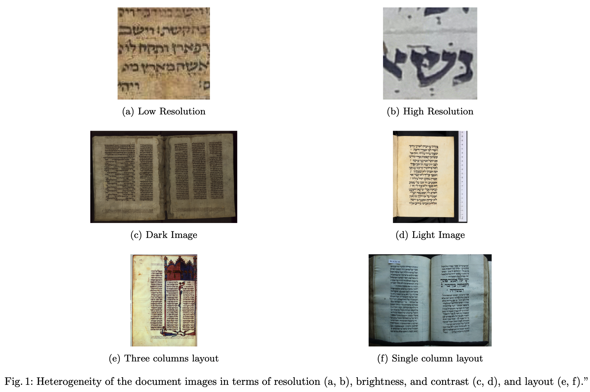

# midrash_ASC_dataset
Ashkenazi Square Clustering (ASC) dataset contains handwritten Hebrew document images that are required to be clustered according to their paleographic features. Essentially, we are aware of two groups, German and French scripts ([Olszowy-Schlanger, 2017](https://www.nli.org.il/en/articles/RAMBI990006168700705171/NLI)). However, no labels are provided. The problem is entirely unsupervised, and the output needs to be evidence-based, providing the user with the reasons that lead to a specific clustering.
The dataset comprises document images from 55 different manuscripts provided by Judith Olszowy-Schlanger. The images exhibit heterogeneity in terms of layout, resolution, brightness, and contrast. 

# Description of each file and folder included in this repository.

- **ASC_dataset**: This folder contains 220 images sourced from 55 manuscripts. Each manuscript contributes 4 pages, and the images are named sequentially following the "manuscriptname_pagename" convention.

- **mapping_sequentialnames_to_metadata.txt**: This text file provides a mapping between the sequential names of the images and their metadata. The structure is formatted as "manuscriptname pagename date region city".

- **ASC_dataset_metadata.xlsx**: Prepared by paleographer Daria Vasyutinsky, this Excel file contains detailed metadata for each image. The metadata compilation follows guidelines established by Judith Olszowy-Schlanger.

- **textregion_and_textline_detections_in_coco_format.json**: This JSON file includes bounding box coordinates for the main text regions and the text lines within these regions across the document images, formatted in COCO format.

- **visualize_textregion_and_textline_detections.py**: This Python script visualizes the text region and text line bounding boxes on the images.

